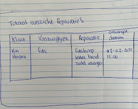
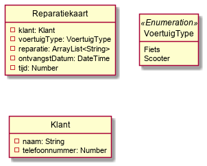
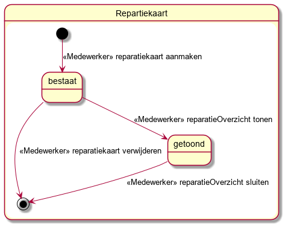
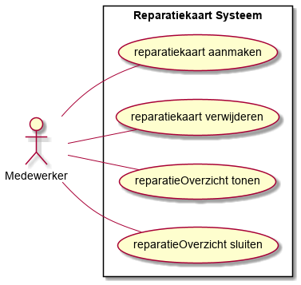

:toc: marco
:numbered:  1

= Functioneel Ontwerp

toc::[]

== Inleiding
**TODO:** __Inleidend verhaal waarin verteld wordt tot welke MVP van het Visie / Scope document dit document is gebaseerd. Teaser van de hoofdstukken van dit document __.

== Domein Model

Het domein model komt tot stant door klassen die we uit de User Stories kunnen extraheren.

=== Analyse van de User Stories
Deze MVP is gebaseerd op twee User Stories.

==== User Story #5

**User Story (#5):  Als medewerker wil ik een reparatiekaart digitaal kunnen aanmaken zodat deze fietsreparatie correct geregistreerd wordt/leesbaar opgeslagen wordt.**

image::./../assets/images/schets-us5.png[Schets, 300, 300]

Uit deze User Story kunnen we de klasse **Reparatiekaart** extraheren, en de attributen voor deze klasse extraheren we uit de schets afleiden.

Omdat bij "Soort fiets" een keuze gemaakt wordt uit soorten en dit in principe een fixed lijstje is hebben we hiervoor een enumeration klasse **VoertuigType** vastgesteld.

Verder moet worden opgemerkt dat inmiddels is gebleken dat het attribuut __prijs__ voor het aanmaken van een reparatiekaart geen goed attribuut bleek te zijn. Dit attribuut is derhalve komen te vervalen.

==== User Story #7 

**User Story (#7): Als medewerker wil ik een totaal overzicht kunnen inzien van alle reparaties zodat ik actuele informatie kan verkrijgen over reparaties**

Uit deze User Story gebruiken we nog steeds de klasse **Reparatiekaart** om het overzicht van alle reparaties te tonen. In User story 5 worden deze attributen ingevuld waarna deze hier worden getoond. Verder was opgemerkt dat op de "reparatiekaart" verstrekt door de opdrachtgever ook nog een attribuut stond over het ontvangstdatum. Deze is vervolgens toegevoegd, zodat de medewerker ook weet wanneer het voertuig in ontvangst is genomen. 

Ook komt er uit deze schets een nieuwe user story uit voort: "Als medewerker wil ik een totaal overzicht kunnen inzien van alle klanten die een reparatie hebben zodat ik informatie over mijn klanten kan verkrijgen" Van de klant weten we alleen de naam en deze moeten we ook kunnen bereiken voor bepaalde omstandigheden. Dit zou in principe ook in de reparatiekaart kunnen als extra attribuut: telefoonnummer. 

Als we naderhand meer attributen over de klant moeten verkrijgen is het beter om deze in een aparte klasse te onderhouden. Hierdoor zorg je voor een betere scheiding tussen de klassen, waardoor complexe onderhoud en dubbele data voorkomen kan worden.

=== Het Domein Model

Het resultaat van de analyse van de User Stories is het volgende Domein Model.

Nader inzien is toch de keuze gemaakt om Klant als een aparte klasse op te nemen. De naam van de klant zal in het overzicht getoond worden, maar zal een relatie/link leggen met de Klant klasse. Deze uitwerking zal veel samenhang en overeenkomsten  hebben met user story 5 en 7.  

== Klasse Reparatiekaart

Deze klasse komt voort uit user story 5. Hier gaan we dieper op deze klasse in.

=== Toestandsdiagram

Op basis van User Story #5 kunnen we de transitie van de start node naar de een toestand die we voor nu "bestaat" hebben genoemd verantwoorden.

Op basis van User Story #7 kunnen we de transitie van de toestand: "bestaat" naar een nieuwe toestand "getoond" verantwoorden. Hierbij wordt de overzicht van alle reparaties opgehaald en getoond. Deze toestand wordt vervolgens gesloten door de reparatieOverzicht te sluiten.

Omdat elke toestand minimaal een uitgaande transitie vereist en de life cycle van de instantie van een object ook eindig zou moeten zijn is het verantwoord om een transitie "reparatiekaart verwijderen" aan het diagram toe te voegen.

Het resulterende toestandsdiagram voor instanties van de klasse Reparatiekaart komt dan als volgt eruit te zien:

[%autowidth, options=header]
|===
| Toestand | Kenmerk
| bestaat | alle attributen hebben een waarde != NULL
|===

=== Use Case Diagram

Op basis van het toestandsdiagram kunnen we het volgende Use Case Diagram opstellen.

Als we de Use Cases uitzetten tegen de onderkende User Stories valt op te maken dat er nog geen User Story is voor de Use Case "Reparatiekaart verwijderen". Dit is een issue en zou met de opdrachtgever besproken moeten worden.

Verder hebben we ook nog de Use Case "reparatieOverzicht sluiten". Dit betreft een kleine Use Case dat gaat om het afsluiten van het overzicht. Dit kan door het overzicht weg te klikken. 

Maar voor deze sprint waarin we de User Stories #5 en #7 willen gaan realiseren is deze Use Case niet vereist en heeft dus geen impact op de voortgang van deze sprint.

[%autowidth, options=header]
|===
| - | US #5 | US# 7 | US #8 | US #9 | US #12 | US #13
| UC: Reparatiekaart aanmaken | x | | | | | 
| UC: Reparatiekaart verwijderen | | | | | |
| UC: ReparatieOverzicht tonen | | x | | | |
| UC: ReparatieOverzicht sluiten | | | | | |
|===

=== Use Template

Nu dat duidelijk is welke Use Cases we in deze sprint moeten uitwerken kunnen we nu voor elke Use Case een Use Case Template uitwerken.

[%autowidth]
|===
| Use Case Nr: | 1
| Use Case Naam: | Reparatiekaart aanmaken
| Actor: | Medewerker
| Samenvatting: | **TODO**
| Pre-conditie: | n.v.t.
| Main Scenario: 
a|  [start=1]
. Systeem toont formulier 
  ( velden: naam klant [set], soort fiets [set], reparatie [set], tijd [set] )
. Actor vult formulier
. Systeem
.. Systeem valideert
.. Systeem slaat de informatie op

| Post-conditie | Er is een nieuwe instantie van de Reparatiekaart aangemaakt en deze bevind zich in de toestand "bestaat".
| Alternatief Scenario 
a| 
[%autowidth, cols="2,1"]
!===

! Trigger ! Stap 3a in Main Scenario [niet alle velden zijn gevuld]
! Scenario 
a! . Systeem
.. Systeem toont foutmelding
.. Systeem keert terug naar stap 1 van het Main Scenario

!===

|=== 

[%autowidth]
|===
| Use Case Nr: | 2
| Use Case Naam: | ReparatieOverzicht tonen
| Actor: | Medewerker
| Samenvatting: | De actor vraagt om een overzicht van alle geregistreerde reparaties met de naam van de klant [GET], de soort fiets [GET], de reparatie [GET], OntvangstDatum [GET] en geschatteTijd [GET]. Het systeem haalt vervolgens deze hierbovenstaande informatie op en toont het. 
| Pre-conditie: | n.v.t.
| Main Scenario: 
a|  [start=1]
. Systeem vraagt om het overzicht te tonen.
. Actor geeft aan om het overzicht te tonen.
. Systeem toont overzicht 
  met de velden: naam klant [GET], soort fiets [GET], reparatie [GET], ontvangstDatum [GET] en geschatteTijd [GET])

| Post-conditie | Het reparatieOverzicht is getoond en bevindt zich in het toestand "getoond"
| Alternatief Scenario 
a| 
[%autowidth, cols="2,1"]
!===

! Trigger ! Stap 3 in Main Scenario [Geen reparatiekaart aanwezig]
! Scenario 
a! . Systeem
.. Systeem toont foutmelding
.. Systeem keert terug naar stap 1 van het Main Scenario

!===

|=== 

=== Sitemap

=== Wireframe